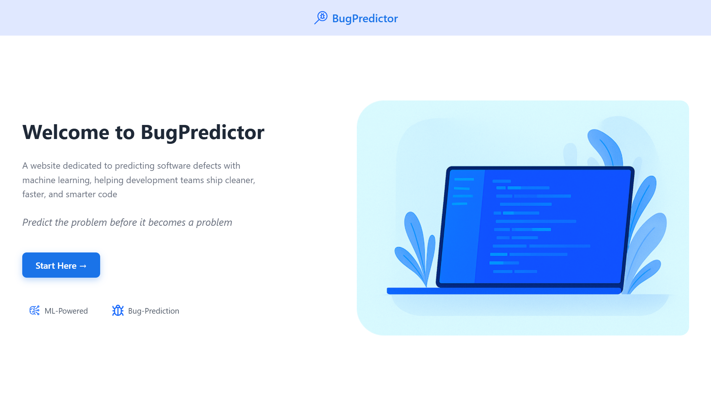

# bugpredictor
BugPredictor is a full end-to-end platform designed to predict software defects using machine learning, enhanced with genetic algorithm optimization. It includes a complete Python backend, an interactive web interface, automated preprocessing, and detailed performance visualization.  🧠 Predict the problem before it becomes a problem.

## 🚀 Features

- 🔮 **Machine Learning–powered defect prediction**  
- 🧬 **Genetic Algorithm optimization** (hyperparameters + feature selection)  
- ⚖️ **Before vs After optimization performance comparison**  
- 📤 **Dataset upload system** (CSV/ARFF supported)  
- 📈 **Visual metrics** (F1-score, Precision, Recall, Confusion Matrix)  
- 🌐 **Modern user interface** (BugPredictor Frontend)  
- 📁 **Modular project structure** for research & production use  
- 🔍 Supports both **intra-project** and **cross-project** prediction  

---

## 📸 Screenshots

Below is a preview of the BugPredictor interface.

### 🏠 Home Page  
A clean introduction to the platform with a welcoming UI.



---

### 📤 Dataset Upload  
Drag & drop your CSV or ARFF file to begin the analysis.


---

### ⚙️ Processing Pipeline  
The system processes the dataset, trains the model, and optimizes parameters step by step.


---

### 🧬 Genetic Algorithm Optimization  
Parameters are improved using a custom genetic algorithm.


---

### 📊 Performance Improvement Summary  
You can clearly see the improvement after optimization.


---

### ⚖️ Model Comparison (Default vs Optimized)


---

## 🧠 Machine Learning Pipeline

### 1️⃣ Data Preparation
- Missing values → median imputation  
- Feature filtering  
- Class imbalance correction using **SMOTE**  
- Normalization and preprocessing  

### 2️⃣ Algorithms Implemented
- **Support Vector Machine (SVM)**  
- **K-Nearest Neighbors (KNN)**  
- **Random Forest**  
- **Logistic Regression**  

### 3️⃣ Evaluation
- Precision  
- Recall  
- F1-Score  
- Confusion Matrix  

---

## 🧬 Genetic Algorithm Optimization

The GA improves both the **accuracy** and **stability** of the prediction pipeline by:

- 📌 Selecting the most relevant software metrics  
- 📌 Optimizing hyperparameters (C, Gamma, K, etc.)  
- 📌 Increasing F1-Score, Recall, and Precision  
- 📌 Reducing model dimensionality  
- 📌 Producing more trustworthy predictions  

---

## 📈 Results Example

| Metric      | Default Model | Optimized Model | Improvement |
|-------------|--------------|-----------------|-------------|
| F1-Score    | 0.42         | 0.61            | +17%        |
| Precision   | 0.40         | 0.60            | +17%        |
| Recall      | 0.43         | 0.59            | +17%        |

These improvements are visualized dynamically on the website.

## 📁 Project Structure

interface-main/
└── Interface
├── algorithms
│ ├── knn
│ └── svm
├── datasets
├── frontend
│ ├── assets
│ ├── pages
│ └── styles
├── notebooks
├── results
│ └── knn
│ ├── ant
│ ├── camel
│ ├── ivy
│ ├── jedit
│ ├── log4j
│ ├── lucene
│ ├── poi
│ ├── tomcat
│ ├── velocity
│ └── xalan
├── scripts
├── trained_models
└── pycache

### Folder Summary
- **algorithms/** — ML models + GA optimizers  
- **datasets/** — Input datasets  
- **frontend/** — Full BugPredictor UI  
- **notebooks/** — Testing & research notebooks  
- **results/** — Performance charts for each dataset  
- **scripts/** — Processing, SMOTE, utilities  
- **trained_models/** — Saved optimized ML models

- ## ⚙️ Installation & Running

### 🔧 Backend Setup
```bash
git clone https://github.com/yassinedache/REPO.git
cd REPO
python -m venv venv
source venv/bin/activate   # Windows: venv\Scripts\activate
pip install -r requirements.txt
python app.py

## 🛠️ Technologies Used

### 🔧 Backend
- Python  
- Scikit-learn  
- Pandas / NumPy  
- Imbalanced-learn (SMOTE)  
- Custom Genetic Algorithm  

### 🌐 Frontend
- HTML / CSS / JavaScript  
- Tailwind-style modern UI  
- Responsive, component-based layout  

### 📊 Data
- UCI Machine Learning Repository  
- Kaggle software defect datasets  

---

## 📚 Applications

This project is useful for:

- 🔍 Early bug detection in large codebases  
- 🧪 Software quality and reliability research  
- 🏭 QA automation and test prioritization  
- 📈 Risk analysis and decision support  
- 🎓 Academic capstone / PFE projects  

---

## 🏁 Conclusion

**BugPredictor** combines machine learning, metaheuristics, and a complete web interface to deliver a powerful software defect prediction system.

It provides:
- Clean and intuitive visual feedback  
- Modular, extensible architecture  
- Support for real-world datasets  
- Significant performance improvements through optimization  

🚀 *A practical tool for developers, researchers, and QA engineers.*

